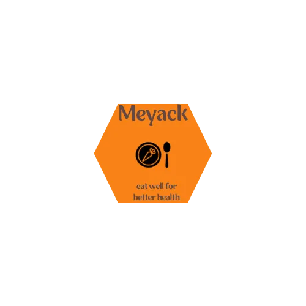

![Meyack!]

## Table of Content

- Presentation
- Features
- Architecture
- Installation and Use
- Authors
- License


# Meyack: eat well for better health

Meyack Eat Well for Better Health aims to provide a vast database of balanced, varied recipes that respect the diets of its users. The application aims to help users adopt a healthier dietary lifestyle by offering nutritious and tasty recipes.

## Features

#### *varied recipes:*

 Meyack is an web application that offers to the user a database of varied healthy, tasty and nutritious recipes. 


#### *Intuitive and User-Friendly Interface:*

Designing an intuitive and user-friendly interface for easy navigation and recipe discovery.

#### *User and Account Management:*
Meyack protect the data of it's users, you can update your personnal information

#### *Advanced features:*

 Allows to user to filter its recipe based on its diet, it will allows user to add recipes on their favorite list.

#### *perspectives:*

Allows to the user to create a recipe, post her meal to calculate the number of calories,
plan the meal for the week
track her physical activity

## Architecture

 The architecture of this project is based on the following technologies:

- React for the front-end,


- Node.js, expressjs and mongodb for the back-end.


)
## Installation and Use on development

to launch react from the development environment
```bash
npm start
```
to launch API rest on the folder /api
```bash
npm run start
```

## Authors


[Leticia Habib](https://www.linkedin.com/in/l%C3%A9ticia-habib-dev/)

 #C21 Holberton School Laval
## License

[MIT](https://choosealicense.com/licenses/mit/)

